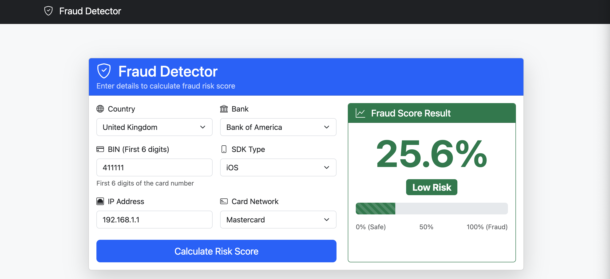
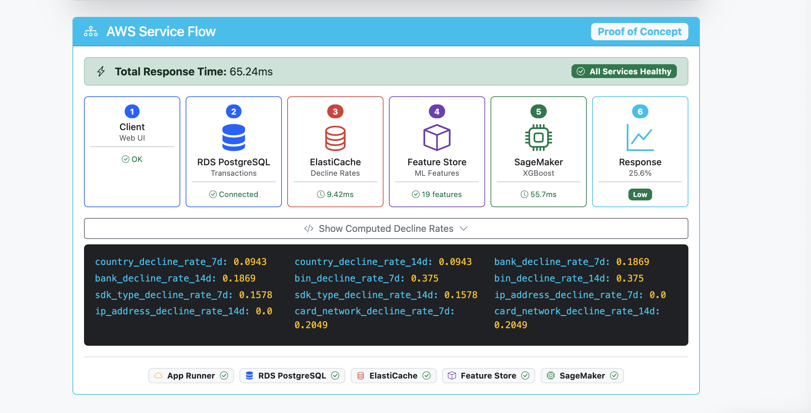

# Fraud Detector

A real-time fraud detection system built with Ruby on Rails and AWS SageMaker.

**Live Demo:** https://qikfvt5v4r.us-east-1.awsapprunner.com/

## Screenshots





## Architecture

- **AWS App Runner** - Hosts the Rails API
- **AWS RDS PostgreSQL** - Stores transaction history
- **AWS ElastiCache Redis** - Caches decline rate calculations
- **AWS SageMaker** - XGBoost ML model for fraud scoring
- **Feature Store** - ML feature engineering pipeline

## Features

- Real-time fraud scoring via XGBoost model
- Decline rate features calculated from historical transaction data
- Redis caching for low-latency feature lookups
- Visual service flow debugging in UI

## Local Development

```bash
# Install dependencies
bundle install

# Set up database
rails db:create db:migrate db:seed

# Start Redis (required for decline rates)
redis-server

# Run the server
rails server
```

## Environment Variables

Copy `.env.example` to `.env` and configure:

```bash
cp .env.example .env
```

Required variables:
- `AWS_ACCESS_KEY_ID` - AWS credentials
- `AWS_SECRET_ACCESS_KEY` - AWS credentials
- `SAGEMAKER_ENDPOINT_NAME` - SageMaker endpoint name
- `REDIS_URL` - Redis connection URL
- `DATABASE_URL` - PostgreSQL connection URL

## SageMaker Model

See [sagemaker/README.md](sagemaker/README.md) for model training and deployment instructions.

## API

### POST /predictions

Request:
```json
{
  "fraud_prediction": {
    "country": "US",
    "bank": "chase",
    "bin": "411111",
    "sdk_type": "ios",
    "ip_address": "192.168.1.1",
    "card_network": "visa"
  }
}
```

Response:
```json
{
  "score": 0.15,
  "risk_level": "low",
  "confidence": 85
}
```
